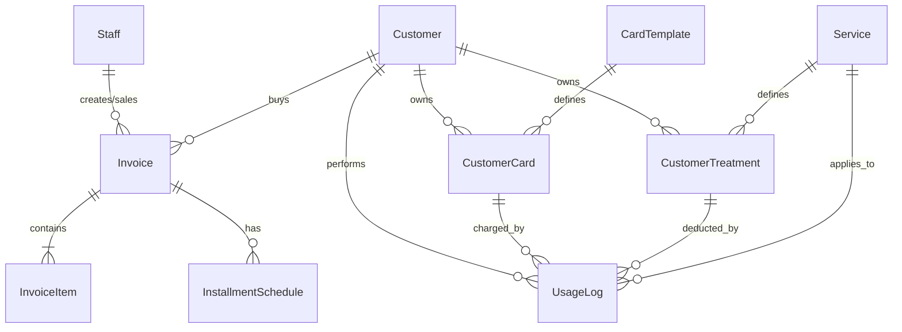

# 📐 ĐẶC TẢ KỸ THUẬT: spa-crm (Web App CRM Thẩm Mỹ Viện)

Tài liệu này đặc tả chi tiết về cấu trúc dữ liệu, luồng nghiệp vụ và thiết kế hệ thống cho dự án **spa-crm**.

---

## 1. CÔNG NGHỆ (TECH STACK)
- **Frontend & Backend API:** Next.js 14+ (App Router) với TypeScript.
- **Styling:** Vanilla CSS (CSS Modules) cho hiệu năng tối đa và dễ tùy biến giao diện premium (chế độ sáng/tối, gradients, micro-animations).
- **Cơ sở dữ liệu:** Supabase (PostgreSQL) - Lưu trữ đám mây persistent, hỗ trợ cơ chế bảo mật và giao diện quản trị dữ liệu trực quan.
- **ORM (Giao tiếp DB):** Prisma ORM hoặc `@supabase/supabase-js`.

---

## 2. CẤU TRÚC CƠ SỞ DỮ LIỆU (DATABASE SCHEMA)

Dưới đây là thiết kế các bảng dữ liệu bằng PostgreSQL:

### 2.1. Bảng `Staff` (Nhân viên)
Lưu thông tin tài khoản đăng nhập của nhân viên spa.
- `id` (UUID, Primary Key)
- `username` (Text, Unique)
- `password_hash` (Text)
- `full_name` (Text)
- `role` (Text) - Mặc định: 'staff'
- `created_at` (Timestamp)

### 2.2. Bảng `Customer` (Khách hàng)
Lưu trữ thông tin khách hàng và tự động phân hạng.
- `id` (UUID, Primary Key)
- `phone` (Text, Unique) - Dùng làm tài khoản đăng nhập cho khách
- `password_hash` (Text) - Mật khẩu mặc định khi tạo tài khoản
- `full_name` (Text)
- `dob` (Date) - Ngày sinh
- `address` (Text)
- `gender` (Text) - Nam/Nữ/Khác
- `cccd` (Text, Unique)
- `notes` (Text) - Ghi chú riêng cho khách
- `total_spent` (Decimal) - Tổng chi tiêu lũy kế (dùng để phân hạng)
- `tier` (Text) - Hạng thành viên (tính toán tự động: Member, Silver, Gold, Diamond, VIP, VIP+, Business, Business+)
- `created_at` (Timestamp)

### 2.3. Bảng `Service` (Dịch vụ)
Danh mục các dịch vụ spa cung cấp.
- `id` (UUID, Primary Key)
- `name` (Text)
- `price` (Decimal) - Giá bán tiêu chuẩn
- `tags` (JSONB) - Các nhãn đi kèm (ví dụ: ["chăm sóc da", "body"])
- `created_at` (Timestamp)

### 2.4. Bảng `CardTemplate` (Mẫu thẻ tài khoản trả trước)
Định nghĩa các loại thẻ nạp tiền khuyến mãi (Ví dụ: Mua thẻ 10tr được 30tr).
- `id` (UUID, Primary Key)
- `name` (Text) - Tên thẻ (Ví dụ: Thẻ Gold 10M)
- `price` (Decimal) - Giá gốc khách hàng thực tế phải trả (Ví dụ: 10,000,000đ)
- `value` (Decimal) - Giá trị thực tế nạp vào tài khoản được dùng (Ví dụ: 30,000,000đ)
- `services` (JSONB) - Mảng chứa danh sách ID dịch vụ được áp dụng (nếu trống tức là áp dụng tất cả)
- `created_at` (Timestamp)

### 2.5. Bảng `CustomerCard` (Thẻ của khách hàng)
Lưu thông tin các thẻ tài khoản mà khách hàng đã mua và số dư còn lại.
- `id` (UUID, Primary Key)
- `customer_id` (UUID, Foreign Key -> Customer)
- `template_id` (UUID, Foreign Key -> CardTemplate)
- `original_price` (Decimal) - Số tiền mua thật ban đầu
- `original_value` (Decimal) - Số dư tổng ban đầu (bao gồm khuyến mãi)
- `current_balance` (Decimal) - Số dư tổng còn lại hiện tại
- `created_at` (Timestamp)

### 2.6. Bảng `CustomerTreatment` (Liệu trình/Dịch vụ của khách hàng)
Lưu các dịch vụ lẻ hoặc liệu trình nhiều buổi khách đã mua.
- `id` (UUID, Primary Key)
- `customer_id` (UUID, Foreign Key -> Customer)
- `service_id` (UUID, Foreign Key -> Service)
- `total_sessions` (Integer) - Tổng số buổi (1 cho dịch vụ 1 lần, >1 cho liệu trình)
- `used_sessions` (Integer) - Số buổi đã sử dụng (Ví dụ: 2 trong gói 6 buổi -> `2/6`)
- `price_paid` (Decimal) - Số tiền thực trả cho dịch vụ/liệu trình này
- `created_at` (Timestamp)

### 2.7. Bảng `Invoice` (Hóa đơn)
- `id` (UUID, Primary Key)
- `customer_id` (UUID, Foreign Key -> Customer)
- `staff_id` (UUID, Foreign Key -> Staff) - Nhân viên sale phụ trách (được tick doanh số)
- `total_amount` (Decimal) - Tổng tiền hàng trước chiết khấu
- `discount` (Decimal) - Số tiền giảm giá, khuyến mãi
- `final_amount` (Decimal) - Số tiền cuối cùng khách phải thanh toán
- `payment_type` (Text) - 'cash' (trả thẳng) hoặc 'installment' (trả góp)
- `installment_months` (Integer) - Kỳ hạn trả góp: 6, 9, 12 tháng (nếu có)
- `bank_fee` (Decimal) - Phí chuyển đổi trả góp ngân hàng thu (nếu có)
- `internal_notes` (Text) - Ghi chú nội bộ
- `created_at` (Timestamp)

### 2.8. Bảng `InvoiceItem` (Chi tiết hóa đơn)
- `id` (UUID, Primary Key)
- `invoice_id` (UUID, Foreign Key -> Invoice)
- `item_type` (Text) - 'service' hoặc 'card'
- `item_id` (UUID) - ID của Service hoặc CardTemplate tương ứng
- `price` (Decimal)
- `quantity` (Integer)

### 2.9. Bảng `InstallmentSchedule` (Lịch thu nợ trả góp)
Tự động tạo ra các kỳ thanh toán khi hóa đơn là trả góp.
- `id` (UUID, Primary Key)
- `invoice_id` (UUID, Foreign Key -> Invoice)
- `due_date` (Date) - Ngày hạn thanh toán (chia đều mỗi 30 ngày)
- `amount` (Decimal) - Số tiền phải đóng kỳ này
- `status` (Text) - 'pending' (chưa đóng) hoặc 'paid' (đã đóng)
- `paid_at` (Timestamp, Nullable)

### 2.10. Bảng `UsageLog` (Nhật ký sử dụng dịch vụ)
Ghi nhận mỗi lần khách hàng sử dụng dịch vụ (quẹt thẻ hoặc làm liệu trình).
- `id` (UUID, Primary Key)
- `customer_id` (UUID, Foreign Key -> Customer)
- `service_id` (UUID, Foreign Key -> Service)
- `source_type` (Text) - 'card' (trừ tiền thẻ) hoặc 'treatment' (trừ số buổi liệu trình)
- `source_id` (UUID) - ID của CustomerCard hoặc CustomerTreatment tương ứng
- `amount_deducted` (Decimal) - Số tiền bị trừ (nếu dùng thẻ)
- `sessions_deducted` (Integer) - Số buổi trừ (thường là 1)
- `performed_by` (Text) - Tên kỹ thuật viên thực hiện liệu trình
- `used_at` (Timestamp)
- `notes` (Text)

---

## 3. SƠ ĐỒ QUAN HỆ THỰC THỂ (ERD DIAGRAM)

---

## 4. QUY TẮC PHÂN HẠNG THÀNH VIÊN (TIER RULES)

Hạng thành viên của khách hàng được tự động cập nhật dựa trên tổng số tiền thực chi (`total_spent`) tích lũy trên hóa đơn:
- **Member:** >= 5,000,000đ
- **Silver:** >= 10,000,000đ
- **Gold:** >= 20,000,000đ
- **Diamond:** >= 30,000,000đ
- **VIP:** >= 50,000,000đ
- **VIP+:** >= 100,000,000đ
- **Business:** >= 500,000,000đ
- **Business+:** >= 1,000,000,000đ

---

## 5. CÔNG THỨC CHIA TỶ LỆ SỐ DƯ THẺ (TRANSPARENCY FORMULA)

Khi khách hàng truy cập Customer Portal để xem thẻ trả trước, hệ thống tính toán động số dư thực tế còn lại và số dư khuyến mãi còn lại:
- **Tỷ lệ thực tế (Ratio_Real):** $Ratio\_Real = \frac{Original\_Price}{Original\_Value}$
- **Tỷ lệ khuyến mãi (Ratio_Promo):** $Ratio\_Promo = 1 - Ratio\_Real$
- **Số dư thực tế hiển thị:** $Real\_Balance = Current\_Balance \times Ratio\_Real$
- **Số dư khuyến mãi hiển thị:** $Promo\_Balance = Current\_Balance \times Ratio\_Promo$
- **Ví dụ cụ thể:** 
  - Khách nạp thẻ giá gốc 10tr được tổng số dư 30tr ($Ratio\_Real = 1/3 \approx 33.33\%$).
  - Khách dùng dịch vụ hết 3tr (trừ vào số dư tổng còn 27tr).
  - Cổng thông tin khách hàng sẽ hiển thị: 
    - Tổng số dư: `27,000,000đ`
    - Tiền thực tế còn lại: `9,000,000đ`
    - Tiền khuyến mãi còn lại: `18,000,000đ`
